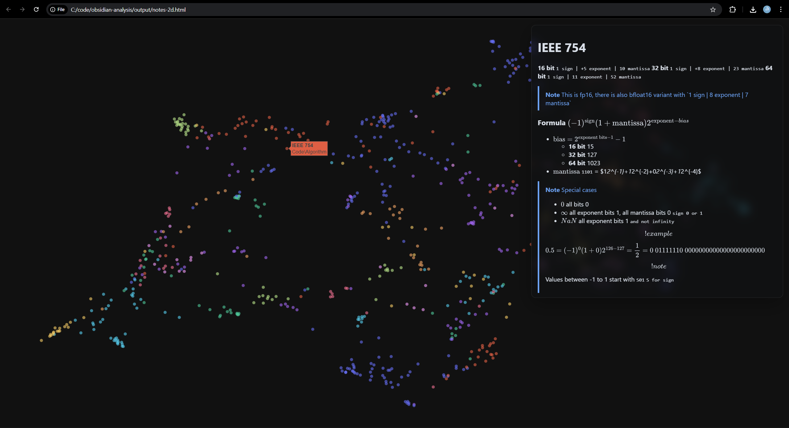
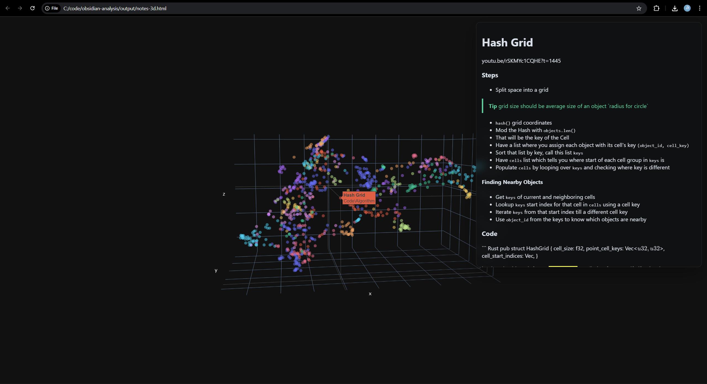
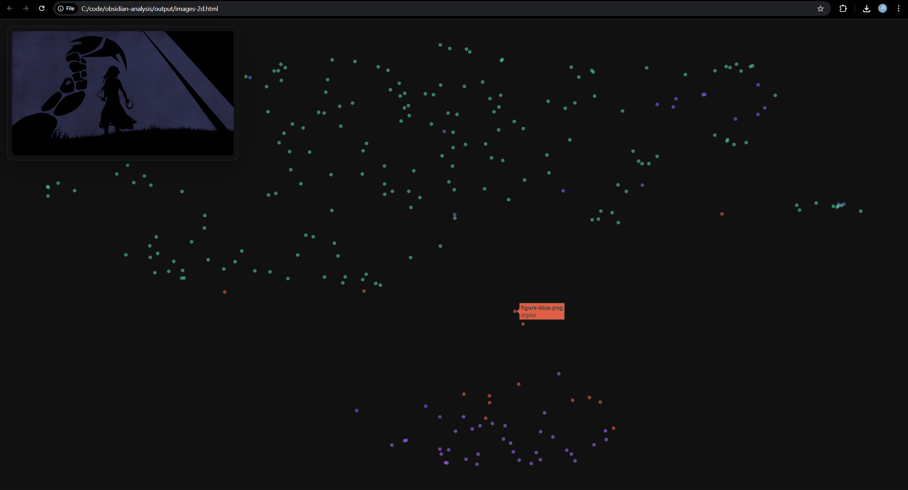
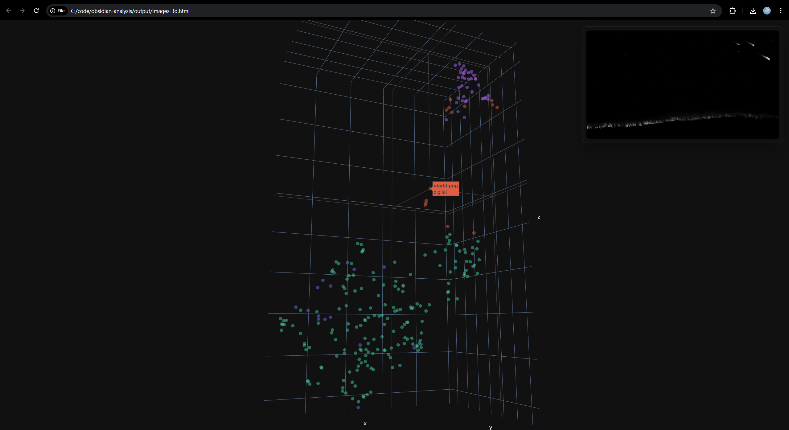

Analyze and visualize your obsidian vault and images based on semantic similarity

 
 

- `main.py` 
    - generates `notes.pkl` which contains all notes from `obsidian/` and their embeddings using `Qwen3-Embedding-4B`
    - generates `images.pkl` which contains all images from `images/` and their embeddings using `Qwen3-VL-Embedding-2B` 
- `plot.py` creates interactive 2D/3D point map of your notes and images positioned based on semantic similarity
- `query.py` searches top most related notes based on your query
- `gap.py` detects similar notes that are not linked `[[My Note]] <--> [[Related Note]]`
- `word.py` analyzes top most used words
- `config.py` what embedding model to use etc.

### How to use

- `pip install -r requirements.txt`
- drop your obsidian notes inside `obsidian/`
- drop your images inside `images/`
- run `python main.py`
- run `python plot.py`
