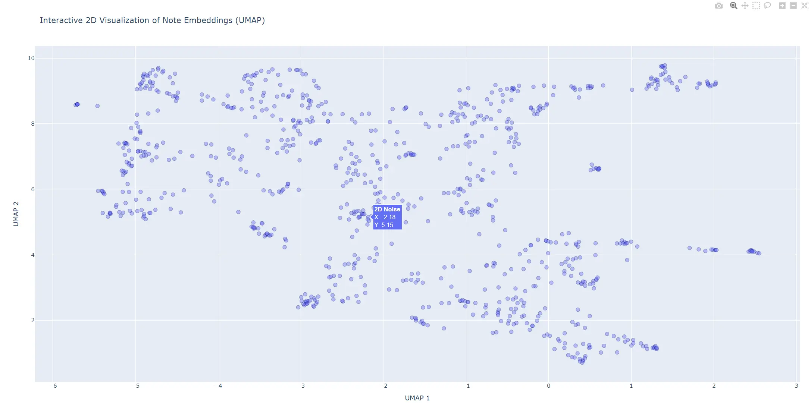
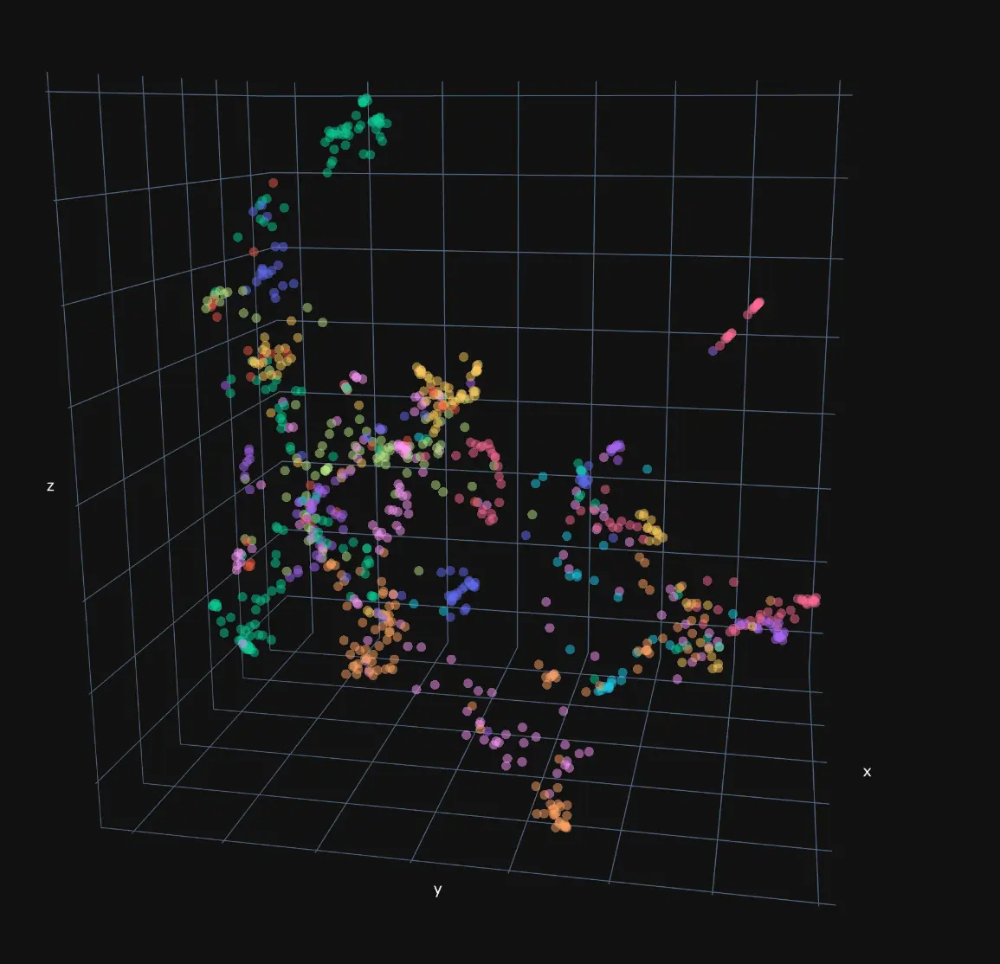

Analyze and visualize your obsidian vault
 

- `main.py` generates `notes.pkl` file which contains all your notes and their embeddings using `Qwen3-Embedding-4B`
- `plot.py` plots semantic similarity 2D and 3D interactive map
- `query.py` searches top most related notes based on your query
- `gap.py` detects similar notes that are not linked `[[My Note]] <--> [[Related Note]]`
- `word.py` analyzes top most used words
- `config.py` what embedding model to use etc.

### How to use

- `pip install -r requirements.txt`
- drop your obsidian notes inside `obsidian/`
- run `main.py`
- run `plot.py` or any other script you are interested in
